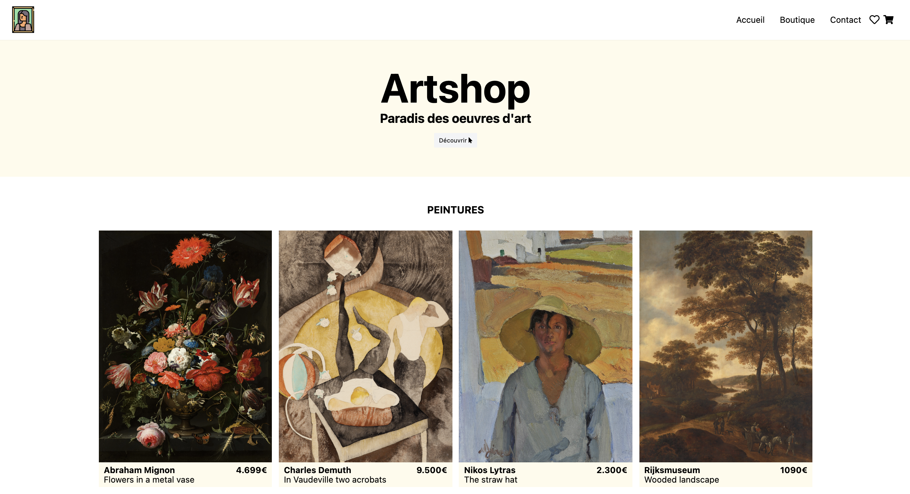

# Artshop (Tailwind)

Site (fictif) de vente d'oeuvres d'art entièrement mis en forme à l'aide du framework CSS Tailwind.

## 🚀 Installation

1. git clone ou télécharger le projet
2. ouvrir le fichier "index.html" situé à la racine

## 💫 Demo

Vidéo de démonstration de l'application disponible [ici](https://drive.google.com/file/d/1sLLfqyYfETF59tDaqDbxJ_3zhF-OeYKb)

## :exclamation: Précision

À noter que le projet n'a pas été purgé exprès (du css inutilisé) en vue de futures modifications.
